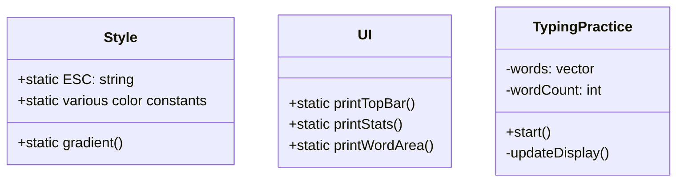

# ⌨️ Typing Practice

<div align="center">

[](https://github.com/in-jun/Typing-practice/stargazers)
[](https://isocpp.org/)

> 🚀 프로그래밍 키워드로 타자 실력과 코드 친숙도를 동시에 향상시키는 개발자 특화 연습 도구

</div>

---

## 📋 목차

-   [기능 개요](#-기능-개요)
-   [시스템 요구사항](#-시스템-요구사항)
-   [프로그램 구조](#-프로그램-구조)
-   [사용자 인터페이스](#-사용자-인터페이스)
-   [연습 단어 목록](#-연습-단어-목록)

---

## ✨ 기능 개요

### 핵심 기능

-   🎯 **실시간 측정**

    -   WPM (Words Per Minute)
    -   CPM (Characters Per Minute)
    -   정확도 백분율
    -   경과 시간 표시

-   📊 **시각적 피드백**

    -   컬러 코딩된 진행 상태
    -   그래디언트 텍스트 효과
    -   오류 하이라이팅
    -   진행률 바

-   🎨 **고급 UI 요소**
    -   단어 미리보기
    -   스타일링된 출력

## 💻 시스템 요구사항

### 필수 요구사항

```yaml
컴파일러:
    - GCC 5.0+
    - ANSI 컬러 지원 터미널

운영체제:
    - Linux
    - macOS
    - Windows (ANSI 지원 터미널)

라이브러리:
    - STL (C++11 이상)
```

## 🔧 프로그램 구조

### 주요 클래스



### 스타일 시스템

| 스타일 종류 | 용도        | 예시        |
| ----------- | ----------- | ----------- |
| PRIMARY     | 주요 텍스트 | 현재 단어   |
| SECONDARY   | 보조 텍스트 | 미리보기    |
| SUCCESS     | 성공 표시   | 정확도      |
| ERROR       | 오류 표시   | 잘못된 입력 |
| WARNING     | 경고 표시   | 타이머      |

## 🎮 사용자 인터페이스

### 화면 구성

```
TYPING PRACTICE

     0 WPM     0 CPM  100%  00:00  ──────────────────── (0%)

  drop  query  where  some

❯
```

### 통계 표시

-   WPM: 분당 단어 수
-   CPM: 분당 문자 수
-   정확도: 올바른 입력 비율
-   진행률: 시각적 진행 바

### 단어 선택 기준

-   실제 코딩에서 빈번히 사용되는
-   다양한 프로그래밍 언어 포함
-   난이도 균형 고려
-   실용성 중심

---

<div align="center">

**[맨 위로 올라가기](#-typing-practice)**

⭐ **이 프로젝트가 도움이 되었다면 GitHub Star를 눌러주세요** ⭐

Made with ❤️ by [in-jun](https://github.com/in-jun)

</div>
